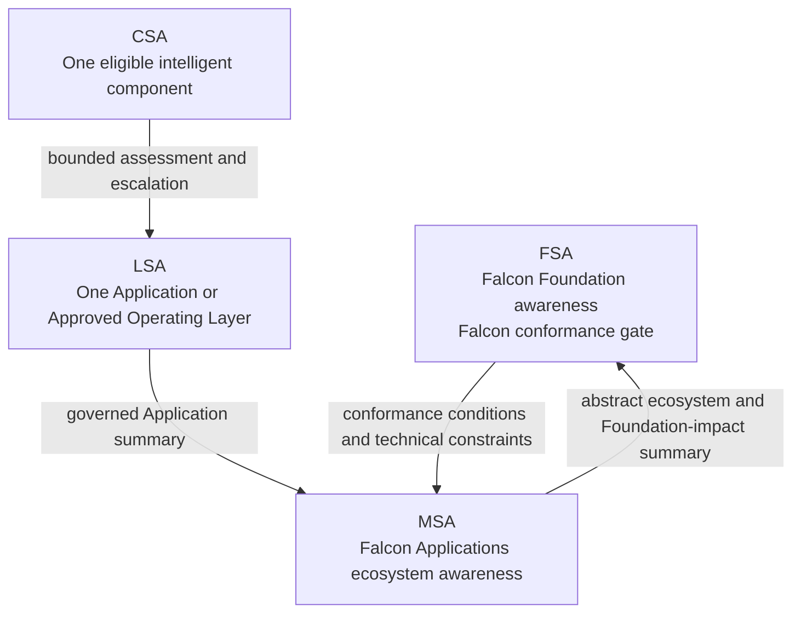
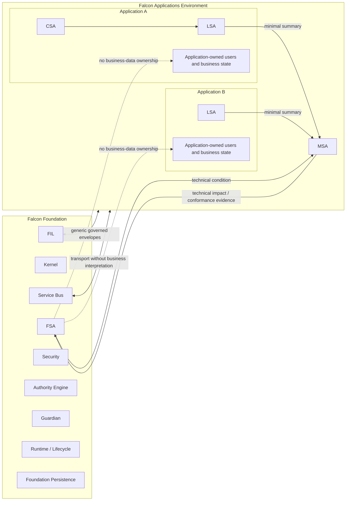
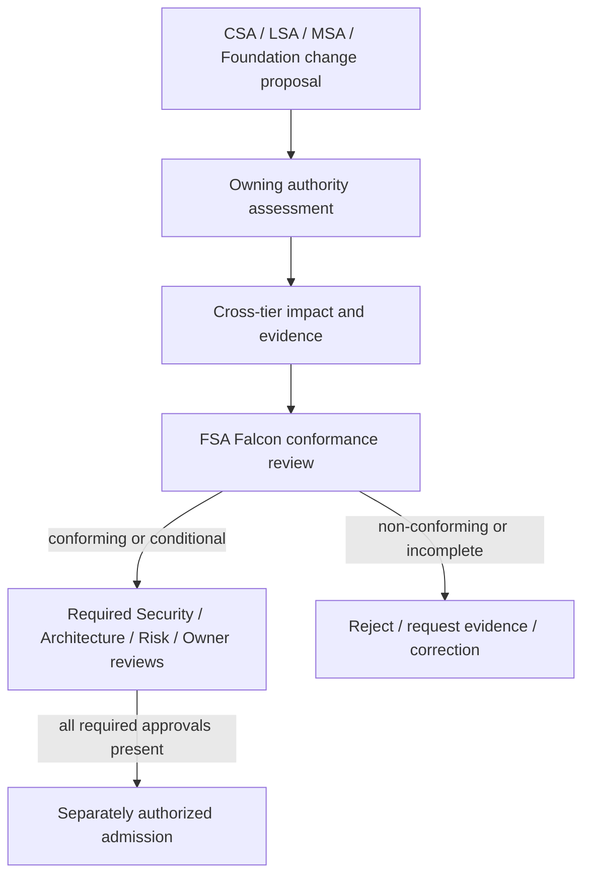
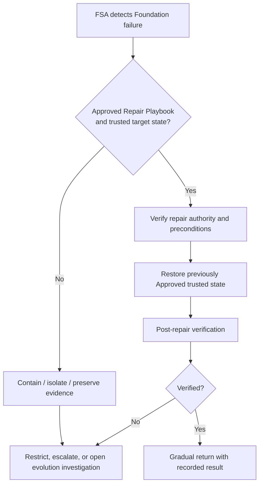
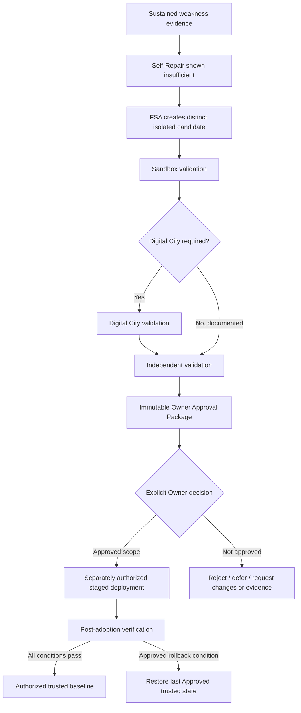
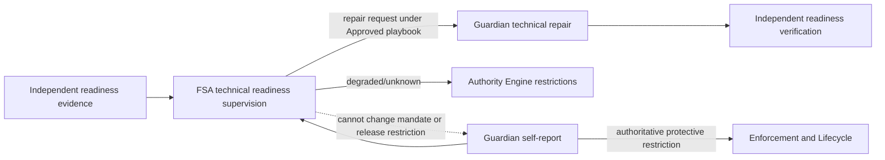

# Awareness Hierarchy and Boundary Diagrams

**Status:** Approved Supporting Architecture  
**Approval Record:** GOV-061  
**Authority:** Proposed ADR-I009

## 1. Awareness Hierarchy

The arrows do not transfer ownership or authority.

## 2. Foundation/Application Boundary

## 3. Change-Conformance Flow

FSA is the final self-awareness and Falcon conformance gate. It is not the final authority for every approval class.

## 4. Governing Boundary Statements

- CSA understands the component.
- LSA understands the Application.
- MSA understands the Falcon Applications ecosystem.
- FSA protects Falcon itself and assesses conformance for admission.
- Higher awareness rank does not acquire lower-tier ownership.
- Foundation protects Application infrastructure without interpreting Application business.
- FIL carries meaning; the owning Application owns that meaning.
- Guardian protects; Authority Engine authorizes; FSA assesses awareness and conformance.

## 5. Bounded Self-Repair Flow

## 6. Controlled Self-Evolution Flow

> FSA may build the proposed replacement. FSA may not appoint the proposed replacement.

## 7. Guardian Readiness Relationship

