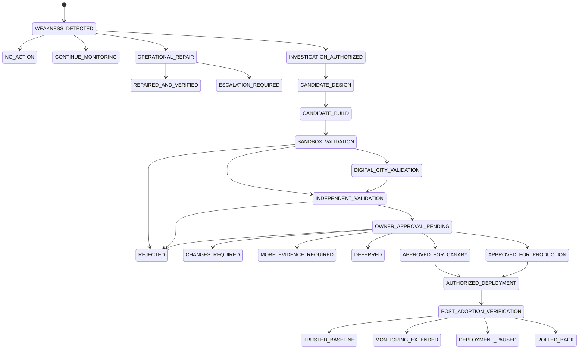
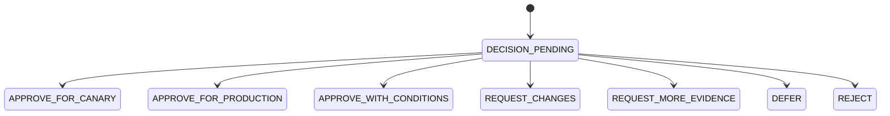

# FSA Candidate and Owner Decision Lifecycle

**Status:** Approved Supporting Architecture  
**Approval Record:** GOV-061  
**Execution Authority:** Not Granted

## 1. Candidate Lifecycle

## 2. State Definitions

| State | Meaning | Authority Effect |
|---|---|---|
| `WEAKNESS_DETECTED` | evidence indicates a possible issue | none |
| `INVESTIGATION_AUTHORIZED` | bounded analysis is permitted | no candidate authority |
| `CANDIDATE_DESIGN` | proposed solution is being designed | non-operational |
| `CANDIDATE_BUILD` | distinct candidate artifacts are produced | non-authoritative |
| `SANDBOX_VALIDATION` | isolated local validation | no production reliance |
| `DIGITAL_CITY_VALIDATION` | governed system-impact simulation | no production reliance |
| `INDEPENDENT_VALIDATION` | validators independent of FSA evidence production evaluate | no promotion |
| `OWNER_APPROVAL_PENDING` | immutable case awaits explicit Owner decision | silence is no approval |
| `APPROVED_FOR_CANARY` | Owner permits only declared Canary | no broader activation |
| `APPROVED_FOR_PRODUCTION` | Owner permits declared production stage | deployment still separate |
| `AUTHORIZED_DEPLOYMENT` | competent mechanisms execute approved plan | scope fixed |
| `POST_ADOPTION_VERIFICATION` | deployed behavior is evaluated | not yet trusted baseline |
| `TRUSTED_BASELINE` | all conditions and registration authority satisfied | new Approved trusted state |
| `REJECTED` | candidate may not progress | isolated/retained/destroyed by policy |
| `DEFERRED` | no current progression authority | non-operational |
| `CHANGES_REQUIRED` | new revision and evidence required | prior approval request closed |
| `MORE_EVIDENCE_REQUIRED` | case incomplete | no activation |
| `ROLLED_BACK` | last Approved state restored | candidate cannot reactivate automatically |

## 3. Transition Invariants

- Tests do not create approval.
- FSA recommendation does not create approval.
- Owner approval does not directly deploy.
- Deployment completion does not create trusted-baseline status.
- Every material candidate revision receives a new identity or version and new decision binding.
- Approval conditions cannot be widened by FSA.
- Failure or unknown evidence cannot advance lifecycle.

## 4. Owner Decision State Model

An Owner decision is valid only for the exact candidate, Evidence Set, scope, deployment stage, conditions, and validity recorded.

## 5. Periodic Evaluation Outcomes

- `NO_ACTION`
- `CONTINUE_MONITORING`
- `OPERATIONAL_REPAIR`
- `CONFIGURATION_REVIEW`
- `CAPABILITY_GAP_RECORDED`
- `SELF_EVOLUTION_CANDIDATE`
- `SECURITY_REVIEW`
- `ARCHITECTURE_REVIEW`
- `OWNER_NOTIFICATION`

Periodic evaluation does not automatically replace a component.
